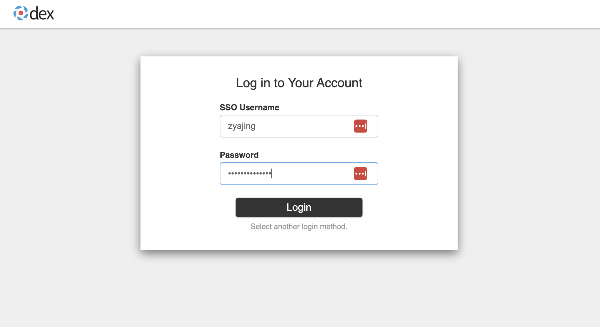

====
LDAP
====

----
Goal
----

The goal of Kubeflow integrate with VMware LDAP Server is that we can login Kubeflow using VMware employee LDAP account. As follow screenshots, choose 'Log in with OpenLDAP', input your VMware account, then you can log in Kubeflow successfully. When you log in Kubeflow, Kubeflow will create your own user profile automatically.

.. image:: ../_static/operation-guide-auth-ldap-goal01.png

.. image:: ../_static/operation-guide-auth-ldap-goal03.png

-------------------------
Enable "Log in with LDAP"
-------------------------

""""""""""""""""""""""
Update Dex's configmap
""""""""""""""""""""""

Dex use a configmap for its configuration.

You need to edit `Dex's configmap  <https://github.com/vmware/ml-ops-platform-for-vsphere/blob/main/manifests/common/dex/base/config-map.yaml>`__ to change the ``issuer`` to {public_ip}/dex and add LDAP connector.

.. code-block:: shell

    kubectl edit configmap dex -n auth

.. code-block:: shell

  # Change the issuer to {public_ip}/dex
  # issuer: http://dex.auth.svc.cluster.local:5556/dex
  issuer: http://10.105.150.43/dex

  # --     some configurations we don't care    -- #
  # --     some configurations we don't care    -- #

  staticPasswords:

  # --     staticClstaticPasswordsients configuration we don't care   -- #
  # --     staticClstaticPasswordsients configuration we don't care   -- #

  staticClients:

  # --     staticClients configuration we don't care   -- #
  # --     staticClients configuration we don't care   -- #

  connectors:
  - type: ldap
    name: OpenLDAP
    id: ldap
    config:
      # Host and optional port of the VMware LDAP server in the form "host:port".
      # More detailes here: https://dexidp.io/docs/connectors/ldap/
      host: ldaps.eng.vmware.com:636
      insecureNoSSL: false
      insecureSkipVerify: true
      bindDN: ""
      bindPW: ""
      usernamePrompt: SSO Username
      userSearch:
        baseDN: ou=people,dc=vmware,dc=com
        filter: "(objectclass=inetOrgPerson)"
        username: uid
        idAttr: DN
        emailAttr: mail
        nameAttr: cn  

Edit the dex's configmap to add a LDAP connector for our Kubeflow AuthService.

* issuer: Change the issuer to {public_ip}/dex.

For the LDAP connector, you will need to finished the `LDAP connector configurations <https://dexidp.io/docs/connectors/ldap/>`__.

"""""""""""""""""""""""""""""""""""
Update oidc-authservice's configmap
"""""""""""""""""""""""""""""""""""

You need to edit `oidc-authservice's configmap  <https://github.com/vmware/ml-ops-platform-for-vsphere/blob/main/manifests/common/oidc-authservice/base/params.env>`__ change the ``OIDC_PROVIDER`` to {public_ip}/dex.

.. code-block:: shell

    kubectl edit configmap oidc-authservice-parameters -n istio-system

    # Change the OIDC_PROVIDER to {public_ip}/dex
    OIDC_PROVIDER: http://10.105.150.43/dex

"""""""""""""""""""""""""""""""""""""""""""
Update configmap and Restart dex deployment
"""""""""""""""""""""""""""""""""""""""""""

.. code-block:: shell

    # run the following two lines to update dex config with the user you add
    kubectl get configmap dex -n auth -o yaml | kubectl replace -f -
    kubectl get configmap oidc-authservice-parameters -n istio-system -o yaml | kubectl replace -f -
    # restart dex deployment to make the new configuration work
    kubectl rollout restart deployment dex -n auth

----------------------------------------
Enable Enable automatic profile creation
----------------------------------------

"""""""""""""""""""""""""""""""""""
Update centraldashboard's configmap
"""""""""""""""""""""""""""""""""""

The automatic profile creation can be enabled as part of the deployment by setting the ``CD_REGISTRATION_FLOW`` env variable to true. Modify the ``<manifests-path>/apps/centraldashboard/upstream/base/params.env`` to set the registration variable to ``true``.

You need to edit  `centraldashboard's configmap <https://github.com/vmware/ml-ops-platform-for-vsphere/blob/main/manifests/apps/centraldashboard/upstream/base/params.env>`_ change the ``CD_REGISTRATION_FLOW`` to ``true``.

.. code-block:: shell

    kubectl edit configmap centraldashboard-parameters -n kubeflow

    # Set CD_REGISTRATION_FLOW to true
    # CD_REGISTRATION_FLOW: false
    CD_REGISTRATION_FLOW: "true"

"""""""""""""""""""""""""""""""""""""""""""""""""
Update centraldashboard deployment and Restart it
"""""""""""""""""""""""""""""""""""""""""""""""""

.. code-block:: shell

  kubectl edit deploy centraldashboard -n kubeflow

  # --     some configurations we don't care    -- #
  spec:
    containers:
    - env:
      ...
      ...
      # Change the value of REGISTRATION_FLOW from false to true
      - name: REGISTRATION_FLOW
        value: "true"

.. code-block:: shell

    # restart centraldashboard deployment
    kubectl get deploy centraldashboard -n kubeflow -o yaml | kubectl replace -f -

When an authenticated user logs into the system and visits the central dashboard for the first time, they trigger a profile creation automatically.
A brief message introduces profiles,  and the user can name their profile and click Finish.  This redirects the user to the dashboard where they can view and select their profile in the dropdown list.

.. image:: ../_static/operation-guide-auth-ldap-login-namespace01.png
.. image:: ../_static/operation-guide-auth-ldap-login-namespace02.png

-------------------------------------------------------
Configure pod security policy for your own user profile
-------------------------------------------------------

Before starting to use Kubeflow, remember to configure the pod security policy for your own user profile in order to create pods. This is important as pod creation is needed for many Kubeflow functions, such as Notebook Server creation. 
Refer to :ref:`configure pod security policy` for more details and instructions.

---------------
Troubleshooting
---------------

""""""""""""""""""""""""""""""""""""""""""""""
Restrict specific LDAP users to login Kubeflow
""""""""""""""""""""""""""""""""""""""""""""""

Most of the time, we hope to specified LDAP users can login Kubeflow, not all LDAP users. Thus we need to add more filter restrictions when searching the directory. 
As follow example, we only allow liuqi and juanl these 2 users to login Kubeflow. 

.. code-block:: shell

  kubectl edit configmap dex -n auth

  ...
      userSearch:
        baseDN: ou=people,dc=vmware,dc=com
        filter: "(objectclass=inetOrgPerson)(|(uid=user1)(uid=user2))"
        ...

""""""""""""""""""""
Pod creation failure
""""""""""""""""""""

You may meet following error in some operation:

.. code-block:: text

    FailedCreate 1s (x2 over 1s) statefulset-controller create Pod test-01-0 in StatefulSet test-01 failed error: pods “test-01-0” is forbidden: PodSecurityPolicy: unable to admit pod: []

This error occurs because you did not configure your pod security policy correctly. To solve this problem, you need to configure pod security policy based on :ref:`configure pod security policy`.
