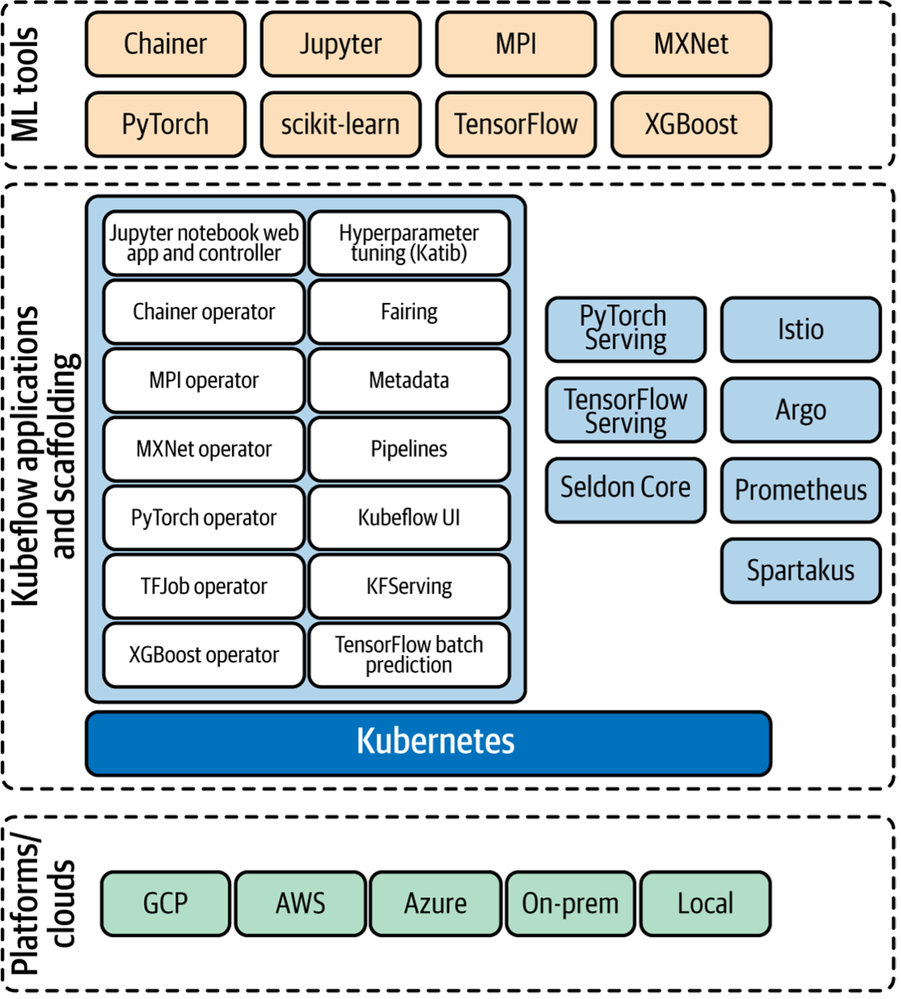

===============================
Open Source Kubeflow Components
===============================

Open Source Kubeflow (OSS Kubeflow) is a platform that provides a complete end-to-end machine learning solution. It includes components for each stage in the machine learning lifecycle, from data preparation to model training and deployment, all within a single, integrated platform. Operators can choose what is best for their users, there is no requirement to deploy every component. Kubeflow is an imperative tool for any organization looking to leverage the power of machine learning to accelerate innovation and drive business value.

Kubeflow streamlines data exploration, enabling users to easily discover and analyze relevant information. With Kubeflow, building and training machine learning models becomes more efficient, as the platform supports hyperparameter tuning and model versioning to optimize performance. Its advanced capabilities also include comprehensive analysis of model performance, ensuring that only the most accurate models are deployed. Additionally, Kubeflow manages compute power and serving infrastructure, allowing for seamless integration with production environments. By offering a cohesive solution for all stages of machine learning development, Kubeflow revolutionizes the way data scientists and engineers create, evaluate, and deploy models.

Jupyter Notebook Services
-------------------------

OSS Kubeflow deployments include services for creating and managing Jupyter Notebooks. You can customize your notebook deployment and your compute resources to suit your data science needs. With this service, you can easily create, edit, and share Jupyter Notebooks with others, collaborate on projects, and save your work in the cloud. 

Pipelines
---------

Kubeflow Pipelines is a comprehensive solution for deploying and managing end-to-end ML workflows. A pipeline is a description of a machine learning workflow, including all the components in the workflow and how the components relate to each other in the form of a graph. A pipeline component is self-contained set of code that performs one step in the ML workflow (pipeline), such as data preprocessing, data transformation, model training, and so on. A component is analogous to a function, in that it has a name, parameters, return values, and a body.

When you run a pipeline, the system launches one or more Kubernetes Pods corresponding to the steps (components) in your workflow (pipeline). The Pods start Docker containers, and the containers in turn start your programs. You can schedule and compare runs, and examine detailed reports on each run.

Machine Learning Metadata DB
----------------------------

The Machine Learning Metadata DB (MLMD) is the metadata management component of OSS Kubeflow. Metadata is the data that includes information about the context of other data and is generated in each phase of the machine learning lifecycle. From the data extraction to the model monitoring phase, all machine learning related processes create specific metadata. Machine Learning Metadata DB is a centralized place for storing the metadata of machine learning models. It includes information such as the creator of different model versions, when they are created, the training data, parameters, and the place and performance metrics of each version of a model. It also provides information about the environment within which an ML model is built.

The Katib Hyperparameter Tuning System
--------------------------------------

Katib is a Kubernetes-native project for automated machine learning. It is a powerful hyperparameter tuning system designed to optimize machine learning model performance on Kubernetes. This highly scalable and flexible system supports various tuning algorithms, integrates seamlessly with popular frameworks, and provides a user-friendly dashboard for monitoring and visualization. By automating the search for optimal hyperparameters, Katib enables data scientists and machine learning engineers to streamline their workflows and focus on more critical aspects of their projects.

Model Training Operators
------------------------

Kubeflow's model training operators play a vital role in simplifying and streamlining machine learning workflows. These operators are designed for popular frameworks like TensorFlow, PyTorch, MXNet, and XGBoost, allowing seamless integration and efficient resource management on Kubernetes. By leveraging these operators, data scientists and machine learning engineers can effectively manage the training process, monitor progress, and scale their experiments. With Kubeflow's operators, users gain the flexibility and power needed to tackle complex machine learning tasks while minimizing infrastructure complexities.

Central Dashboard
-----------------

Central Dashboard serves as the hub for managing and navigating various components within the Kubeflow ecosystem. This user-friendly interface offers a comprehensive overview of your machine learning workflows, including experiment tracking, model training progress, and hyperparameter tuning results. The dashboard simplifies access to various tools and features, such as Jupyter notebooks, pipeline management, and resource allocation. By providing a unified view of your projects, the Central Dashboard enables data scientists and machine learning engineers to monitor and manage their experiments efficiently, thereby accelerating the development and deployment of machine learning models.

.. seealso::
   - `Kubeflow Notebooks <https://www.kubeflow.org/docs/components/notebooks/>`__
   - `Kubeflow Pipelines Introduction <https://www.kubeflow.org/docs/components/pipelines/introduction/>`__
   - `Introduction to Katib <https://www.kubeflow.org/docs/components/katib/overview/>`__
